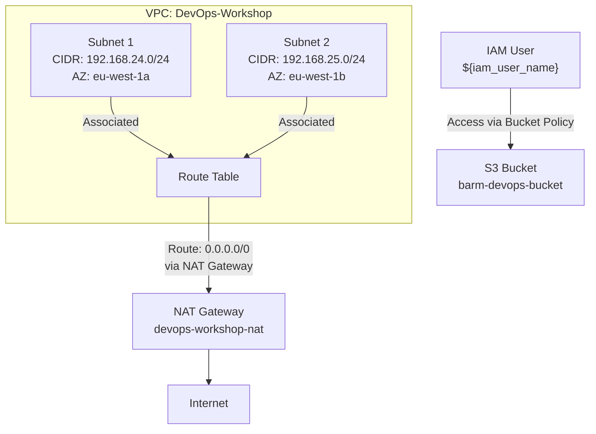

# Terraform Project for AWS Infrastructure Setup

This Terraform project provisions and manages AWS resources, including VPCs, subnets, route tables, NAT gateways, and S3 bucket policies. The project is designed to create a secure and scalable network infrastructure for DevOps workshops.

## High-Level Architecture Diagram



## Usage

Follow these steps to use the project:

1. **Clone the Repository**

   Clone the repository to your local machine:

```bash
 git clone  https://github.com/barmoshe/Wix-devops-workshop-terraform
```

2. **Initialize Terraform**

   Run the following command to download the necessary provider plugins and initialize the backend:

   ```bash
   terraform init
   ```

3. **Apply the Terraform Configuration**

   Apply the configuration to create the infrastructure:

   ```bash
   terraform apply
   ```

   You will be prompted to provide values for variables if they are not set with defaults. Ensure you have the correct AWS credentials configured.

4. **Destroy the Resources**

   To tear down all the infrastructure created by Terraform, run:

   ```bash
   terraform destroy
   ```

## Prerequisites

- AWS account with necessary permissions
- AWS CLI configured with appropriate credentials
- Terraform installed on your local machine

## Terraform AWS Demo

here is link to website created show case how terraform works with some diagrams and code examples <br>
[Click here 😎 ](https://barmoshe.github.io/Wix-devops-workshop-terraform/#home-assignment)

## Additional Information

- **VPC and Subnets**: The project creates subnets within a specified or existing VPC, allowing for organized and secure network segmentation.
- **Route Tables and NAT Gateway**: Ensures that subnets have proper routing, enabling internet access through a NAT gateway while maintaining security.
- **S3 Bucket Policy**: Secures the S3 bucket by restricting access to a specific IAM user, enhancing security and access control.
