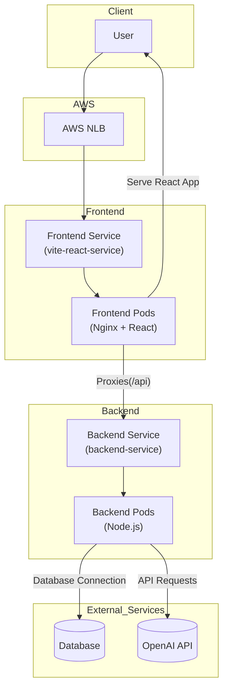
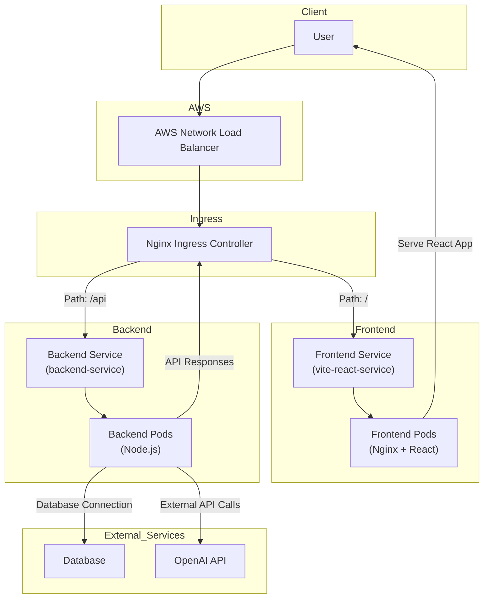

# Wix DevOps Workshop Final Project

## Overview

This project sets up an AWS EKS cluster to run a full-stack Spotify clone application. The repository includes:

- **Terraform configurations** for provisioning the EKS infrastructure (located in the `terraform` directory with its own README).
- **Kubernetes manifests** for deploying the backend and frontend services.
- **AWS Load Balancer Controller** installed within the cluster.
- **Nginx configuration** to proxy frontend requests to the backend service.

## Table of Contents

- [Architecture](#architecture)
- [Prerequisites](#prerequisites)
- [Setup Instructions](#setup-instructions)
  - [1. Infrastructure Setup with Terraform](#1-infrastructure-setup-with-terraform)
  - [2. Install AWS Load Balancer Controller](#2-install-aws-load-balancer-controller)
  - [3. Create Namespace](#3-create-namespace)
  - [4. Create Secrets](#4-create-secrets)
  - [5. Deploy the Backend Service](#5-deploy-the-backend-service)
  - [6. Deploy the Frontend Service](#6-deploy-the-frontend-service)
  - [7. Access the Application](#7-access-the-application)
- [Nginx Configuration](#nginx-configuration)
- [Environment Variables and Secrets](#environment-variables-and-secrets)
- [Notes](#notes)
- [Architecture Diagrams](#architecture-diagrams)
  - [Current Architecture](#current-architecture)
  - [Future Architecture](#future-architecture)

## Architecture

The application consists of a React frontend and a Node.js backend, both deployed on AWS EKS and exposed via a Network Load Balancer (NLB). Nginx is used in the frontend container to proxy API requests to the backend service.

## Prerequisites

- **AWS Account** with permissions to create EKS clusters and related resources.
- **Terraform** installed on your local machine.
- **kubectl** configured to interact with your EKS cluster.
- **AWS Load Balancer Controller** installed in the cluster.
- **AWS IAM permissions** for necessary services.
- **AWS ACM Certificate ARN** for SSL termination.

## Setup Instructions

### 1. Infrastructure Setup with Terraform

Navigate to the `terraform` directory and follow the instructions in its README to set up the AWS EKS cluster.

link to folder : https://github.com/barmoshe/Wix-devops-workshop-final-project/tree/deploy-fullstack-to-kuberntes/terraform

```bash
cd terraform
# Follow the instructions in terraform/README.md
```

### 2. Install AWS Load Balancer Controller

Ensure that the AWS Load Balancer Controller is installed in your EKS cluster. [here](https://github.com/barmoshe/Wix-devops-workshop-final-project/blob/main/terraform/aws-lbc.tf) is the terraform code for it.

### 3. Create Namespace

Create the `spotify` namespace where all the resources will be deployed:

```bash
kubectl create namespace spotify
```

### 4. Create Secrets

Before deploying the backend, create the necessary secrets in the `spotify` namespace:

```bash
kubectl create secret generic db-url-secret -n spotify --from-literal=DB_URL='your_database_url'
kubectl create secret generic open-ai-api-key -n spotify --from-literal=OPEN_AI_API_KEY='your_openai_api_key'
```

### 5. Deploy the Backend Service

Apply the Kubernetes manifests for the backend deployment and service:

```bash
kubectl apply -f spotify-yamls/backend-deployment.yaml
kubectl apply -f spotify-yamls/backend-service.yaml
```

&nbsp;&nbsp;&nbsp;&nbsp;&nbsp;&nbsp; [`backend-deployment.yaml`](https://github.com/barmoshe/Wix-devops-workshop-final-project/blob/main/spotify-yamls/spotify-backend-deployment.yaml)


&nbsp;&nbsp;&nbsp;&nbsp;&nbsp;&nbsp;  [`backend-service.yaml`](https://github.com/barmoshe/Wix-devops-workshop-final-project/blob/main/spotify-yamls/spotify-backend-service.yaml)


### 6. Deploy the Frontend Service

Apply the Kubernetes manifests for the frontend deployment and service:

```bash
kubectl apply -f spotify-yamls/frontend-deployment.yaml
kubectl apply -f spotify-yamls/frontend-service.yaml
```

&nbsp;&nbsp;&nbsp;&nbsp;&nbsp;&nbsp;[`frontend-deployment.yaml`](https://github.com/barmoshe/Wix-devops-workshop-final-project/blob/main/spotify-yamls/spotify-deployment.yaml)

&nbsp;&nbsp;&nbsp;&nbsp;&nbsp;&nbsp; [`frontend-service.yaml`](https://github.com/barmoshe/Wix-devops-workshop-final-project/blob/main/spotify-yamls/spotify-service.yaml)

> **Note:** Replace `"your_acm_certificate_arn"` in `frontend-service.yaml` with your own AWS ACM Certificate ARN.

### 7. Access the Application

Retrieve the DNS name of the Load Balancer:

```bash
kubectl get svc -n spotify
```

Look for the `EXTERNAL-IP` associated with `vite-react-service`. Open this address in your browser to access the Spotify clone application.

## Nginx Configuration

The frontend application uses Nginx to proxy API requests to the backend service. The Nginx configuration is as follows:

```nginx
location /api {
    proxy_pass http://backend-service;
}
```

This configuration ensures that any requests to `/api` on the frontend are forwarded to the backend service.
links to docker files and nginx configuration :

- [frontend-docker-file
](https://github.com/Gal-Or/IsraelifyApp/blob/deploy-to-kubernetes/Dockerfile)

- [nginx-config
](https://github.com/Gal-Or/IsraelifyApp/blob/deploy-to-kubernetes/nginx.conf)
- [backend-docker-file
](https://github.com/barmoshe/Israelify-backend/blob/deploy-to-kubernetes/Dockerfile)
> **Note:** This is a temporary workaround for routing before installing an Ingress Controller to handle the routing.

## Environment Variables and Secrets

The backend deployment uses the following environment variables:

- `NODE_ENV`: Set to `production`.
- `DB_URL`: Database connection string, retrieved from a Kubernetes secret named `db-url-secret`.
- `OPEN_AI_API_KEY`: API key for OpenAI, retrieved from a Kubernetes secret named `open-ai-api-key`.

As shown in [Step 4](#4-create-secrets), make sure to create the necessary secrets before deploying the backend.

## Notes

- The services are configured to use an AWS Network Load Balancer (NLB) and are internet-facing.
- SSL termination is handled by specifying an AWS ACM certificate ARN in the service annotations. Update the ARN in `frontend-service.yaml` with your own certificate ARN.
- Ensure that the `spotify` namespace exists in your cluster.

## Architecture Diagrams
<div align="center">

### Current Architecture


</div>
### Future Architecture

The next step is to add an Nginx Ingress Controller within the cluster to improve traffic routing. Currently, the frontend Nginx image includes a reverse proxy configuration to route `/api` requests to the backend service. While functional, this approach is not ideal, as it adds extra complexity within the frontend image itself.

With an Ingress Controller, routing can be managed directly in the cluster, allowing for more maintainable and centralized traffic control:

- Requests to the root path (`/`) will be directed to the frontend service.
- Requests to `/api` will be routed to the backend service.

This setup will eliminate the need for custom Nginx configurations in the frontend image. The AWS Network Load Balancer (NLB) will direct external traffic to the Ingress Controller, which will handle routing to the appropriate services within the cluster.
<div align="center">


</div>
